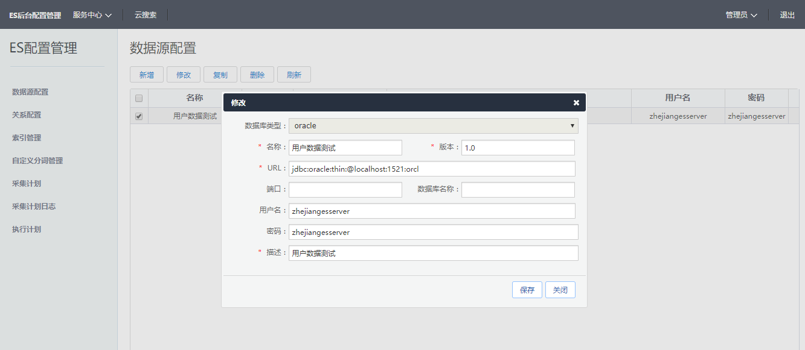
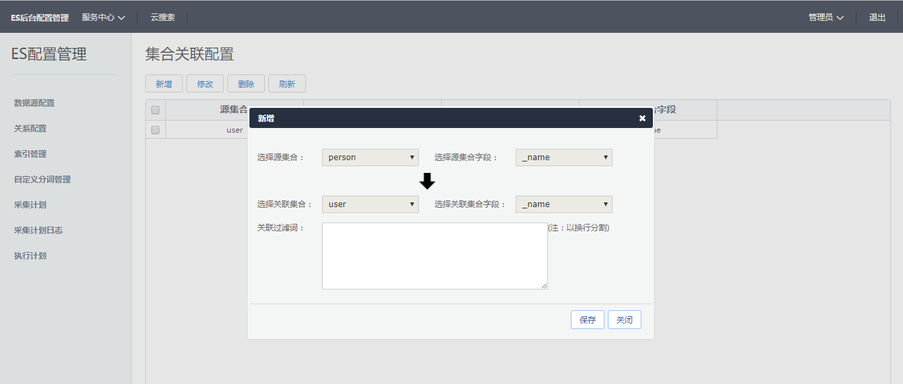

# 统一搜索配置系统用户操作手册


## 1.总流程图
es后台配置管理系统是将数据库（mysql,oracle,hbase,mongo）中的数据通过配置系统存放在es中，在通过es对数据进行检索等操作。


## 2.数据源配置
目前系统支持的数据库类型有四类：mysql,oracle,hbase,mongo

### 2.1新增数据源
后台管理员登录系统后进入“服务中心-ES配置管理-数据源配置”，点击新增操作，进入新增数据源配置界面，如下图：


数据源版本的设置需要跟系统发布时版本的配置一致，否则新增或修改采集计划时不能被选中。

### 2.2编辑数据源
后台管理员登录系统后进入“服务中心-ES配置管理-数据源配置”，选择需要编辑的数据源点击编辑操作，进入编辑数据源配置界面，如下图：



编辑同上的新增操作。

### 2.3删除数据源

数据源配置中选择需要删除的数据源信息，点击删除操作即可，删除数据源后，采集计划的数据源需要重新配置。


## 3.索引管理

### 3.1新增索引
后台管理员登录系统后进入“服务中心-ES配置管理-索引管理”，点击新增操作，进入新增索引管理置界面，如下图：


索引库的名称需要与系统配置中的索引一致，同时确定系统对接的索引库正常启动才能确保索引库成功创建。

### 3.2删除索引

数据源配置中选择需要删除的数据源信息，点击删除操作即可。

### 3.3配置查询权重

后台管理员登录系统后进入“服务中心-ES配置管理-索引管理”，选择需要配置权重的索引，点击“配置查询权重”，进入配置界面，如下图：


此处权重配置与查询结果排序关联。


### 3.4增加搜索历史

后台管理员登录系统后进入“服务中心-ES配置管理-索引管理”，选择需要增加搜索历史的索引，点击“增加搜索历史”操作确认即可，


## 4.采集计划

### 4.1新增采集计划

后台管理员登录系统后进入“服务中心-ES配置管理-采集计划”，点击新增操作，进入新增采集计划映射配置界面，如下图：


选择需要采集计划的类型确认后，进入新增计划界面，如下图：


### 4.2修改采集计划

采集计划中选择需要修改的计划，点击修改操作，直接跳转到修改界面，修改的内容同新增内容。

### 4.3复制采集计划

采集计划中选择想要复制的计划，点击复制操作，直接跳转到编辑界面，编辑的内容同新增内容。

### 4.4删除采集计划

采集计划管理列表中选择要删除的计划，点击删除操作，确认后即删除计划

### 4.5采集计划执行

选择需要执行的采集计划，点击“批量执行”操作，或者可对某一个采集计划进行开始操作，即可开始采集数据。

### 4.5查看采集计划执行日志

后台管理员登录系统后进入“服务中心-ES配置管理-采集计划日志”，列表中显示所有执行的采集计划的结果信息，如下图：


## 5.执行计划

### 5.1新增操作

后台管理员登录系统后进入“服务中心-ES配置管理-执行计划”，点击“新增”操作进入新增界面，如下图：


执行计划：执行计划的选择项为采集计划列表。
bean名称：默认collectionPlanService，可扩展。
方法名：默认startExecute。

### 5.2关闭/开启操作

选择需要定时执行的执行计划，点击“关闭/开启”操作。即开始或停止定时任务。


## 6.关系配置

后台管理员登录系统后进入“服务中心-ES配置管理-关系配置”。

### 6.1关系配置管理

关系配置管理界面中点击“新增”操作进入新增关系配置界面，如下图：



关联的集合及关联字段：在采集计划中设置需要配置关联关系的索引字段中关联字段的信息为选中状态即可，如下图：


### 6.2查看关系信息


##  7自定义分词

后台管理员登录系统后进入“服务中心-ES配置管理-自定义分词”，此模块可对自定义分词进行新增、查看、删除操作。


# 统一搜索 开发文档


# 第一步：准备工作，环境搭建

1、安装memcached
2、安装Elasticsearch，2.4.0版
3、安装zookeeper


# 第二步：web工程开发环境相关配置

1、applicationContext-dubbo.xml


2、filter-dev.properties
图片中标红版本version的参数跟数据源中的版本需要一致，不然不能采集到相关的数据源的数据。


3、pom.xml

添加统一搜索相关的服务包
```xml
		<dependency>
			<groupId>com.tianque</groupId>
			<artifactId>cloud-essqlparse</artifactId>
			<version>2.0.4</version>
		</dependency>
		
		<dependency>
			<groupId>com.tianque</groupId>
			<artifactId>cloud-esclient</artifactId>
			<version>2.0.4</version>
		</dependency>

		<dependency>
			<groupId>com.tianque</groupId>
			<artifactId>cloud-eslistcomponent</artifactId>
			<version>2.0.4</version>
		</dependency>

```

# 第三步：接口调用


```java
@Controller
@RequestMapping("/testSearch")
public class TestSearchController {

	@Autowired
	private ElasticSearchDubboService elasticSearchDubboService;
	@Autowired
	private ElasticConfigDubboService elasticConfigDubboService;

	@RequestMapping(value = "/findCollectionRelationsBySourceCollection")
	@ResponseBody
	public ResultDO<List<CollectionRelationDTO>> findCollectionRelationsBySourceCollection(QueryDTO queryDTO) {
		return elasticConfigDubboService.findCollectionRelationsBySourceCollection("user");
	}

	@RequestMapping(value = "/findIndexFieldBoostByIndex")
	@ResponseBody
	public ResultDO<List<IndexFieldBoostDTO>> findIndexFieldBoostByIndex(String index) {
		return elasticConfigDubboService.findIndexFieldBoostByIndex("tianque");
	}

	@RequestMapping(value = "/getCollectionPlanByName")
	@ResponseBody
	public ResultDO<CollectionPlanDTO> getCollectionPlanByName(String name) {
		return elasticConfigDubboService.getCollectionPlanByName("用户数据测试");
	}

	@RequestMapping(value = "/search")
	@ResponseBody
	public ResultDO<ResultListDTO> search(QueryDTO queryDTO) {
		queryDTO.setIndices(new String[] { "tianque" });
		queryDTO.setCollection(new String[] { "user" });
		queryDTO.setSq("admin");
		queryDTO.setStart(0);
		queryDTO.setRows(100);
		queryDTO.addSortField(new SortField("_username", "desc"));
		SearchQuery searchQuerySecond = new SearchQuery();
		searchQuerySecond.setField("_id");
		searchQuerySecond.setValue("2");
		queryDTO.setSearchQuery(searchQuerySecond);
		return elasticSearchDubboService.search(queryDTO);
	}

	@RequestMapping(value = "/searchBySQL")
	@ResponseBody
	public ResultDO<ResultListDTO> searchBySQL(String sql) {
		sql = " SELECT * FROM tianque.user ";
		return elasticSearchDubboService.searchBySQL(sql);
	}

	@RequestMapping(value = "/count")
	@ResponseBody
	public ResultDO<Long> count(QueryDTO queryDTO) {
		queryDTO.setIndices(new String[] { "tianque" });
		queryDTO.setCollection(new String[] { "user" });
		return elasticSearchDubboService.count(queryDTO);
	}

	@RequestMapping(value = "/aggregationSearch")
	@ResponseBody
	public ResultDO<AggregationResultDTO> aggregationSearch(QueryDTO queryDTO) {
		queryDTO.setIndices(new String[] { "tianque" });
		queryDTO.setCollection(new String[] { "user" });
		AggregationQueryDTO aq = new AggregationQueryDTO();
		aq.setAggregationType(AggregationType.terms);
		aq.setField("name");
		aq.setName("typeGroup");
		queryDTO.setAggregationQuery(aq);
		return elasticSearchDubboService.aggregationSearch(queryDTO);
	}

	@RequestMapping(value = "/searchSuggest")
	@ResponseBody
	public ResultDO<List<String>> searchSuggest(SuggestSearchDTO suggestSearchDTO) {
		suggestSearchDTO.setCollections(new String[] { "user" });
		suggestSearchDTO.setIndices("tianque");
		suggestSearchDTO.setField("name1");
		suggestSearchDTO.setPrefix("管理");
		return elasticSearchDubboService.searchSuggest(suggestSearchDTO);
	}

	@RequestMapping(value = "/exactRelationSearch")
	@ResponseBody
	public ResultDO<ResultListDTO> exactRelationSearch(QueryDTO queryDTO) {
		queryDTO.setIndices(new String[] { "tianque" });
		queryDTO.setCollection(new String[] { "user" });
		Map<String, Object> sourceMessage = new HashMap<>();
		sourceMessage.put("name", "管理员");
		queryDTO.setSourceMessage(sourceMessage);
		return elasticSearchDubboService.exactRelationSearch(queryDTO);
	}
}

```


# 统一搜索 接口文档


# esserver服务描述

esserver统一搜索服务提供者，服务提供一系列搜索服务接口。


## 公共请求参数
参数 | 类型 | 是否必填 | 最大长度 | 描述 | 示例值
------------ | ------------- |-------- |-------- |-------- |--------
 indices| String[] | Y | 100 | 索引库 | tianque
 collection| String[] | Y | 100 | 集合/类型（type） | user
 start| int | N | 100 | 开始行 | 0
 rows| int | N | 100 | 每页数 | 20
 sq| String | N | 100 | 查询关键字 | 张三
 uid| String[] | N | 100 | 名称 | user
 relateCollections| String[] |N | 100 | 关系类型（type） | user
 sortField.field| String |N | 100 | 排序字段| _name
 sortField.sortOrder| String | N | 100 | 排序方式 | desc
 highlightFields| String[] | N | 100 | 高亮 | 
 relationMessageFileds| String[] | N | 100 | 关系字段 | _name


## 响应示例

```javascript
{
    "success":true,
    "errCode":null,
    "errDesc":null,
    "module":{
        "numFound":3,
        "results":[
            {
                "message":{
                    "_name":"张三",
                    "_username":"zsan"
                },
                "index":"tianque",
                "type":"user",
                "id":"22"
            },
            {
                "message":{
                    "_name":"test",
                    "_username":"test"
                },
                "index":"tianque",
                "type":"user",
                "id":"21"
            },
            {
                "message":{
                    "_name":"管理员",
                    "_username":"admin"
                },
                "index":"tianque",
                "type":"user",
                "id":"2"
            }
        ],
        "relationMessageMaps":{

        },
        "exactRelationFields":{
            "user":[
                "_name"
            ]
        }
    }
}
```

## 异常示例

```javascript
{
    "errorMsg":"com.tianque.esserver.exception.ElasticSearchServerException: 全文查询出错！ "
}
```


# 1、接口对象 ElasticSearchDubboService

## 1.1方法名称search 

### 请求参数

参数 | 类型 | 是否必填 | 最大长度 | 描述 | 示例值
------------ | ------------- |-------- |-------- |-------- |--------
 indices| String[] | Y | 100 | 索引库 | 
 collection| String[] | Y | 100 | 集合/类型（type） | 
 relateCollections| String[] | Y | 100 | 名称 | 
 sq| String | N | 100 | 查询关键字 | 
 uid| String | N | 100 | 名称 | 
 searchQuery.field| String | N | 100 | 查询索引字段名 | 
 searchQuery.value| String | N | 100 | 查询索引字段值 | 
 
 

### 请求示例

JAVA   单元测试源码
```java
	@Before
	public void before() {
		elasticSearchDubboService = (ElasticSearchDubboService) context.getBean("elasticSearchDubboService");
	}

	@Test
	public void testExactQuery() {
		QueryDTO queryDTO = new QueryDTO();
		queryDTO.setIndices(new String[] { "tianque" });
		queryDTO.setCollection(new String[] { "user" });
		queryDTO.setSq("admin");
		queryDTO.setStart(0);
		queryDTO.setRows(100);
		queryDTO.addSortField(new SortField("_username", "desc"));
		ResultDO<ResultListDTO> result = elasticSearchDubboService.search(queryDTO);
	}
```
### 响应示例

```java
{
    "success":true,
    "errCode":null,
    "errDesc":null,
    "module":{
        "numFound":3,
        "results":[
            {
                "message":{
                    "_name":"张三",
                    "_username":"zsan"
                },
                "index":"tianque",
                "type":"user",
                "id":"22"
            },
            {
                "message":{
                    "_name":"test",
                    "_username":"test"
                },
                "index":"tianque",
                "type":"user",
                "id":"21"
            },
            {
                "message":{
                    "_name":"管理员",
                    "_username":"admin"
                },
                "index":"tianque",
                "type":"user",
                "id":"2"
            }
        ],
        "relationMessageMaps":{

        },
        "exactRelationFields":{
            "user":[
                "_name"
            ]
        }
    }
}
```
### 异常示例

JSON 示例
```javascript
{
    "errorMsg":"com.tianque.esserver.exception.ElasticSearchServerException: 全文查询出错！ "
}
```

## 1.2方法名称 searchBySQL 

### 请求参数

参数 | 类型 | 是否必填 | 描述
------------ | -------------|-------- |--------
 sql| String | Y | 检索语句 | 
 
 

### 请求示例

JAVA   单元测试源码
```java
	
	@Test
	public void testExactQuery() {
		String sql = " SELECT * FROM tianque.user ";
		ResultDO<ResultListDTO> result = elasticSearchDubboService.searchBySQL(sql);
	}
	
```


### 响应示例

```javascript
{
    "success":true,
    "errCode":null,
    "errDesc":null,
    "module":{
        "numFound":3,
        "results":[
            {
                "message":{
                    "name":"张三",
                    "username":"zsan"
                },
                "index":"tianque",
                "type":"user",
                "id":"22"
            },
            {
                "message":{
                    "name":"test",
                    "username":"test"
                },
                "index":"tianque",
                "type":"user",
                "id":"21"
            },
            {
                "message":{
                    "name":"管理员",
                    "username":"admin"
                },
                "index":"tianque",
                "type":"user",
                "id":"2"
            }
        ],
        "relationMessageMaps":{

        },
        "exactRelationFields":{

        }
    }
}
```
### 异常示例

JSON 示例
```javascript
{
    "errorMsg":"com.tianque.esserver.exception.ElasticSearchServerException: 全文查询出错！ "
}
```


## 1.3方法名称count 

### 请求参数

参数 | 类型 | 是否必填 | 最大长度 | 描述 | 示例值
------------ | ------------- |-------- |-------- |-------- |--------
 indices| String[] | Y | 100 | 索引库 | 
 collection| String[] | Y | 100 | 集合/类型（type） | 
 
 

### 请求示例

JAVA   单元测试源码
```java

	@Test
	public void testExactQuery() {
		QueryDTO queryDTO = new QueryDTO();
		queryDTO.setIndices(new String[] { "tianque" });
		queryDTO.setCollection(new String[] { "user" });
		return elasticSearchDubboService.count(queryDTO);
	}
```
### 响应示例

```java
{
    success: true,
    errCode: null,
    errDesc: null,
    module: 3
}
```
### 异常示例

JSON 示例
```javascript
{
    "errorMsg":"com.tianque.esserver.exception.ElasticSearchServerException: 全文查询出错！ "
}
```


## 1.4方法名称aggregationSearch

### 请求参数

参数 | 类型 | 是否必填 |  描述 | 示例值
------------ | ------------- |-------- |-------- |-------- 
 indices| String | Y |索引库 | 
 collections| String[] | Y |  集合/类型（type） | 
 field| String[] | Y | 索引字段名 | 
 prefix| String | y | 匹配关键字 | 
 
 

### 请求示例

JAVA   单元测试源码
```java
	@Test
	public void testExactQuery() {
		SuggestSearchDTO suggestSearchDTO = new SuggestSearchDTO();
		suggestSearchDTO.setCollections(new String[] { "user" });
		suggestSearchDTO.setIndices("tianque");
		suggestSearchDTO.setField("name1");
		suggestSearchDTO.setPrefix("管理");
		ResultDO<List<String>> result = elasticSearchDubboService.searchSuggest(suggestSearchDTO);
	}
```
### 响应示例

```java
{
    success: true,
    errCode: null,
    errDesc: null,
    module: [
        "管理员"
    ]
}
```
### 异常示例

JSON 示例
```javascript
{
    "errorMsg":"com.tianque.esserver.exception.ElasticSearchServerException: 全文查询出错！ "
}
```

## 1.5方法名称search 

### 请求参数

参数 | 类型 | 是否必填 | 最大长度 | 描述 | 示例值
------------ | ------------- |-------- |-------- |-------- |--------
 indices| String[] | Y | 100 | 索引库 | 
 collection| String[] | Y | 100 | 集合/类型（type） | 
 relateCollections| String[] | Y | 100 | 名称 | 
 sq| String | N | 100 | 查询关键字 | 
 uid| String | N | 100 | 名称 | 
 searchQuery.field| String | N | 100 | 查询索引字段名 | 
 searchQuery.value| String | N | 100 | 查询索引字段值 | 
 
 

### 请求示例

JAVA   单元测试源码
```java
	@Before
	public void before() {
		elasticSearchDubboService = (ElasticSearchDubboService) context.getBean("elasticSearchDubboService");
	}

	@Test
	public void testExactQuery() {
		QueryDTO queryDTO = new QueryDTO();
		queryDTO.setIndices(new String[] { "tianque" });
		queryDTO.setCollection(new String[] { "user" });
		queryDTO.setSq("admin");
		queryDTO.setStart(0);
		queryDTO.setRows(100);
		queryDTO.addSortField(new SortField("_username", "desc"));
		ResultDO<ResultListDTO> result = elasticSearchDubboService.search(queryDTO);
	}
```
### 响应示例

```java
{
    "success":true,
    "errCode":null,
    "errDesc":null,
    "module":{
        "numFound":3,
        "results":[
            {
                "message":{
                    "name":"张三",
                    "username":"zsan"
                },
                "index":"tianque",
                "type":"user",
                "id":"22"
            },
            {
                "message":{
                    "name":"test",
                    "username":"test"
                },
                "index":"tianque",
                "type":"user",
                "id":"21"
            },
            {
                "message":{
                    "name":"管理员",
                    "username":"admin"
                },
                "index":"tianque",
                "type":"user",
                "id":"2"
            }
        ],
        "relationMessageMaps":{

        },
        "exactRelationFields":{
            "user":[
                "name"
            ]
        }
    }
}
```
### 异常示例

JSON 示例
```javascript
{
    "errorMsg":"com.tianque.esserver.exception.ElasticSearchServerException: 全文查询出错！ "
}
```

## 1.6方法名称exactRelationSearch

### 请求参数

参数 | 类型 | 是否必填 |描述 | 示例值
------------ | ------------- |-------- |-------- |-------- 
 indices| String[] | Y | 索引库 | 
 collection| String[] | Y | 集合/类型（type） | 
 sourceMessage| Map<String, Object> | Y | key关系字段名称，关系字段值 | 
 
 

### 请求示例

JAVA   单元测试源码
```java

	@Test
	public void testExactQuery() {
		QueryDTO queryDTO = new QueryDTO();
		queryDTO.setIndices(new String[] { "tianque" });
		queryDTO.setCollection(new String[] { "user" });
		Map<String, Object> sourceMessage = new HashMap<>();
		sourceMessage.put("name", "管理员");
		queryDTO.setSourceMessage(sourceMessage);
		ResultDO<ResultListDTO> result = elasticSearchDubboService.exactRelationSearch(queryDTO);
	}
	
```
### 响应示例

```javascript
{
    "success":true,
    "errCode":null,
    "errDesc":null,
    "module":{
        "numFound":1,
        "results":[
            {
                "message":{
                    "name":"管理员"
                },
                "index":"tianque",
                "type":"person",
                "id":"2"
            }
        ],
        "relationMessageMaps":{

        },
        "exactRelationFields":{
            "person":[

            ]
        }
    }
}
```
### 异常示例

JSON 示例
```javascript
{
    "errorMsg":"com.tianque.esserver.exception.ElasticSearchServerException: 全文查询出错！ "
}
```

# 2、接口对象 ElasticConfigDubboService

##2.1方法名称 findCollectionRelationsBySourceCollection

通过索引类型查找其又关联关系的数据

### 请求参数

参数 | 类型 | 是否必填 |描述 | 示例值
------------ | ------------- |-------- |-------- |-------- 
 sourceCollection| String | Y | 源集合/类型（type） |
 
 

### 请求示例

JAVA   单元测试源码
```java

    public ElasticConfigDubboService elasticConfigDubboService;

	@Before
	public void before() {
		elasticConfigDubboService = (ElasticConfigDubboService) context.getBean("elasticConfigDubboService");
	}

	
	@Test
	public void testExactQuery() {
		ResultDOResultDO<List<CollectionRelationDTO>> result = elasticConfigDubboService.findCollectionRelationsBySourceCollection("user");
	}
	
```
### 响应示例

```javascript
{
    "success":true,
    "errCode":null,
    "errDesc":null,
    "module":[
        {
            "id":3,
            "createUser":null,
            "createDate":null,
            "updateUser":null,
            "updateDate":null,
            "sourceCollection":"user",
            "sourceField":"name",
            "relationCollection":"person",
            "relationField":"name",
            "openState":0,
            "filterWords":null
        },
        {
            "id":21,
            "createUser":null,
            "createDate":null,
            "updateUser":null,
            "updateDate":null,
            "sourceCollection":"user",
            "sourceField":"name",
            "relationCollection":"customer",
            "relationField":"name",
            "openState":0,
            "filterWords":null
        }
    ]
}
```
### 异常示例

JSON 示例
```javascript
{
    "errorMsg":"com.tianque.esserver.exception.ElasticSearchServerException: 全文查询出错！ "
}
```

##2.2方法名称 findCollectionRelationsBySourceCollection

通过索引查找相关的权重信息


### 请求参数

参数 | 类型 | 是否必填 |描述 | 示例值
------------ | ------------- |-------- |-------- |-------- 
 index| String | Y | 索引（type） | tianque
 
 

### 请求示例

JAVA   单元测试源码
```java

    public ElasticConfigDubboService elasticConfigDubboService;

	@Before
	public void before() {
		elasticConfigDubboService = (ElasticConfigDubboService) context.getBean("elasticConfigDubboService");
	}

	
	@Test
	public void testExactQuery() {
		ResultDO<List<IndexFieldBoostDTO>> result = elasticConfigDubboService.findIndexFieldBoostByIndex("tianque");
	}
	
```


### 响应示例

```javascript
{
    "success":true,
    "errCode":null,
    "errDesc":null,
    "module":[
        {
            "id":1,
            "createUser":null,
            "createDate":"2017-08-04 13:56:54",
            "updateUser":null,
            "updateDate":"2017-08-04 14:01:49",
            "searchIndex":"tianque",
            "field":"suggest",
            "boost":30
        },
        {
            "id":2,
            "createUser":null,
            "createDate":"2017-08-04 14:01:49",
            "updateUser":null,
            "updateDate":"2017-08-04 14:01:49",
            "searchIndex":"tianque",
            "field":"username",
            "boost":20
        }
    ]
}
```
### 异常示例

JSON 示例
```javascript
{
    "errorMsg":"com.tianque.esserver.exception.ElasticSearchServerException: 全文查询出错！ "
}
```

## 2.3方法名称 getCollectionPlanByName
 
方法描述：根据采集计划名称查找类型映射信息

### 请求参数

参数 | 类型 | 是否必填 |描述 | 示例值
------------ | ------------- |-------- |-------- |-------- 
 name| String | Y | 采集计划名称，如图 |
 


### 请求示例

JAVA   单元测试源码
```java

    public ElasticConfigDubboService elasticConfigDubboService;

	@Before
	public void before() {
		elasticConfigDubboService = (ElasticConfigDubboService) context.getBean("elasticConfigDubboService");
	}

	
	@Test
	public void testExactQuery() {
		ResultDO<CollectionPlanDTO> result = elasticConfigDubboService.elasticConfigDubboService.getCollectionPlanByName("用户数据测试");
	}
	
```

### 响应示例

```javascript
{
    "success":true,
    "errCode":null,
    "errDesc":null,
    "module":{
        "id":1,
        "name":"用户数据测试",
        "indice":"tianque",
        "collection":"user",
        "documentFieldJson":"[{"column":"id","columnAlias":"e_id","field":"_id","fieldType":"string","indexType":"not_analyzed","relationField":false,"timestamp":false},{"column":"name","columnAlias":"name","field":"name","fieldType":"string","indexType":"not_analyzed","relationField":true,"timestamp":false},{"column":"mobile","columnAlias":"mobile","field":"mobile","fieldType":"completion","indexType":"not_analyzed","relationField":true,"timestamp":false},{"column":"userName","columnAlias":"userName","field":"userName","fieldType":"completion","indexType":"not_analyzed","relationField":false,"timestamp":false},{"column":"name","columnAlias":"name","field":"name1","fieldType":"completion","indexType":"not_analyzed","relationField":false,"timestamp":false}]",
        "documentFieldList":[
            {
                "field":"_id",
                "column":"id",
                "columnAlias":"e_id",
                "fieldType":"string",
                "indexType":"not_analyzed"
            },
            {
                "field":"name",
                "column":"name",
                "columnAlias":"name",
                "fieldType":"string",
                "indexType":"not_analyzed"
            },
            {
                "field":"mobile",
                "column":"mobile",
                "columnAlias":"mobile",
                "fieldType":"completion",
                "indexType":"not_analyzed"
            },
            {
                "field":"userName",
                "column":"userName",
                "columnAlias":"userName",
                "fieldType":"completion",
                "indexType":"not_analyzed"
            },
            {
                "field":"name1",
                "column":"name",
                "columnAlias":"name",
                "fieldType":"completion",
                "indexType":"not_analyzed"
            }
        ]
    }
}
```
### 异常示例

JSON 示例
```javascript
{
    "errorMsg":"com.tianque.esserver.exception.ElasticSearchServerException: 全文查询出错！ "
}
```

# 3、接口对象 ElasticIncrementDubboService
接口提供了对索引文档的新增修改删除等方法，具体方法及参数如下图，此处不多说明。


# 业务错误码

### 公共错误码

错误码 | 错误描述 | 解决方案 |
------------ | ------------- |--------
 201| 网关请求失败 | 请检查网络问题

